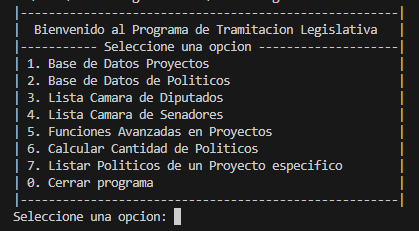

<div align="center">


<br/>


</div>

<br/>


### ▎DESCRIPCIÓN

**Sistema Legislativo** es un sistema de información de consola para simular la tramitación de proyectos de ley en Chile. Desarrollado en **C con TurboC**, aplicando las estructuras de datos vistas en cátedra: árboles binarios de búsqueda, listas enlazadas circulares y listas doblemente enlazadas.

El proyecto fue presentado y defendido oralmente ante el cuerpo docente como evaluación final del semestre.

<br/>


### ▎FUNCIONALIDADES

- **Árbol binario de proyectos de ley** — inserción, eliminación, búsqueda por ID y listado en orden.
- **Base de datos de políticos** — lista circular con operaciones CRUD completas.
- **Cámara de Diputados y Senadores** — listas doblemente enlazadas con agregar, eliminar, buscar y modificar.
- **Comisiones y votaciones** — gestión de comisiones de origen, revisora y mixta, con fases de votación.
- **Proceso de aprobación** — registro de decisión presidencial, publicación y control constitucional.
- **Funciones avanzadas** — edición del proceso legislativo completo de un proyecto específico.
- **Reportes** — conteo de diputados, senadores y listado de políticos involucrados en un proyecto.

<br/>


### ▎ESTRUCTURAS DE DATOS UTILIZADAS

| Estructura | Uso en el proyecto |
|---|---|
|  | Almacenamiento y búsqueda de proyectos de ley por ID |
|  | Base de datos de políticos |
|  | Cámara de Diputados y Cámara de Senadores |
|  | Votos por votación y proyectos por político |
|  | Comisiones, votaciones y proceso de aprobación |

<br/>


### ▎CAPTURAS

| Menu principal |
|---|
|  |

<br/>


### ▎ESTRUCTURA DEL PROYECTO

```
SistemaLegislativoC/
├── screenshots/
│   └── menu_principal.png
├── main.c          # Código fuente completo
└── README.md
```

<br/>


### ▎REQUISITOS Y EJECUCIÓN

**Opción 1 — TurboC (entorno original)**
```
Abrir main.c en TurboC  →  Compilar (Alt+F9)  →  Ejecutar (Ctrl+F9)
```

**Opción 2 — GCC en Windows (recomendado actualmente)**
```cmd
cd ruta\del\proyecto
C:\msys64\ucrt64\bin\gcc.exe main.c -o tramitacion.exe
tramitacion.exe
```

> Para instalar GCC en Windows se recomienda usar [MSYS2](https://www.msys2.org/) con el paquete `mingw-w64-ucrt-x86_64-gcc`.

<br/>


### ▎CONTEXTO ACADÉMICO

Proyecto desarrollado para **Estructura de Datos** INF2223 en la [Pontificia Universidad Católica de Valparaíso (PUCV)](https://www.pucv.cl), 3° semestre de Ingeniería en Informática durante el **2024**.

El sistema fue implementado como evaluación final integradora, aplicando todas las estructuras de datos vistas durante el semestre. Fue presentado y defendido oralmente ante el cuerpo docente y aprobado con una buena nota.

<br/>


### ▎AUTORES

<div align="center">

[](https://github.com/cord0990)
[](https://github.com/PatataSubnormal)
[](https://github.com/cortadew)

</div>

<br/>

